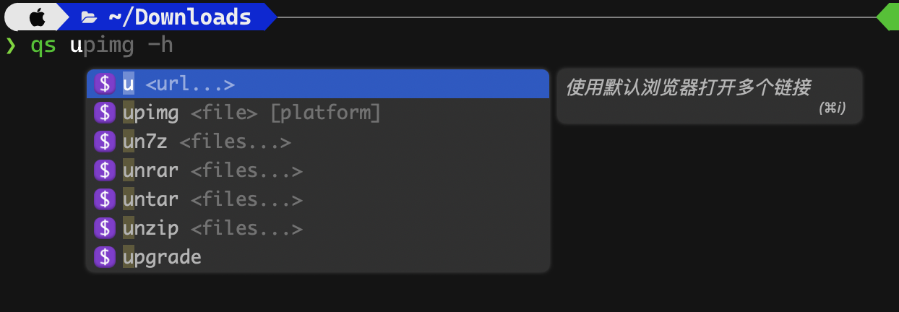

# Completion for [Fig](https://fig.io/)

## Priview



## Setup

### Install Fig

```shell
brew install --cask fig
```

### Create `qs` mixin

```shell
cd ~
npx @withfig/autocomplete-tools@latest init
npm run create-spec qs
cp /path/to/QuickStart_Rhy/complete/fig/qs-<your lang>.ts .fig/user/autocomplete/src/qs.ts
npm run copy-to-global
```

Enjoy !